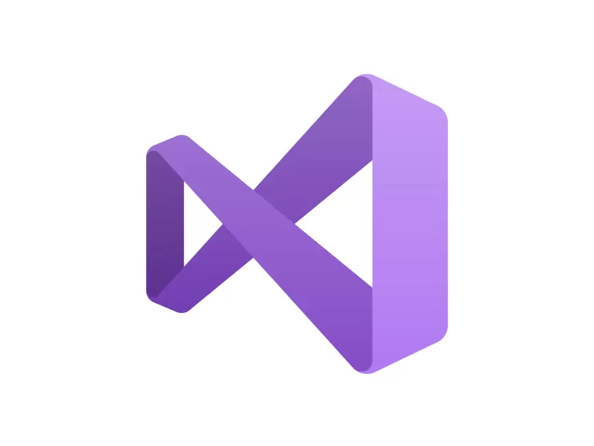
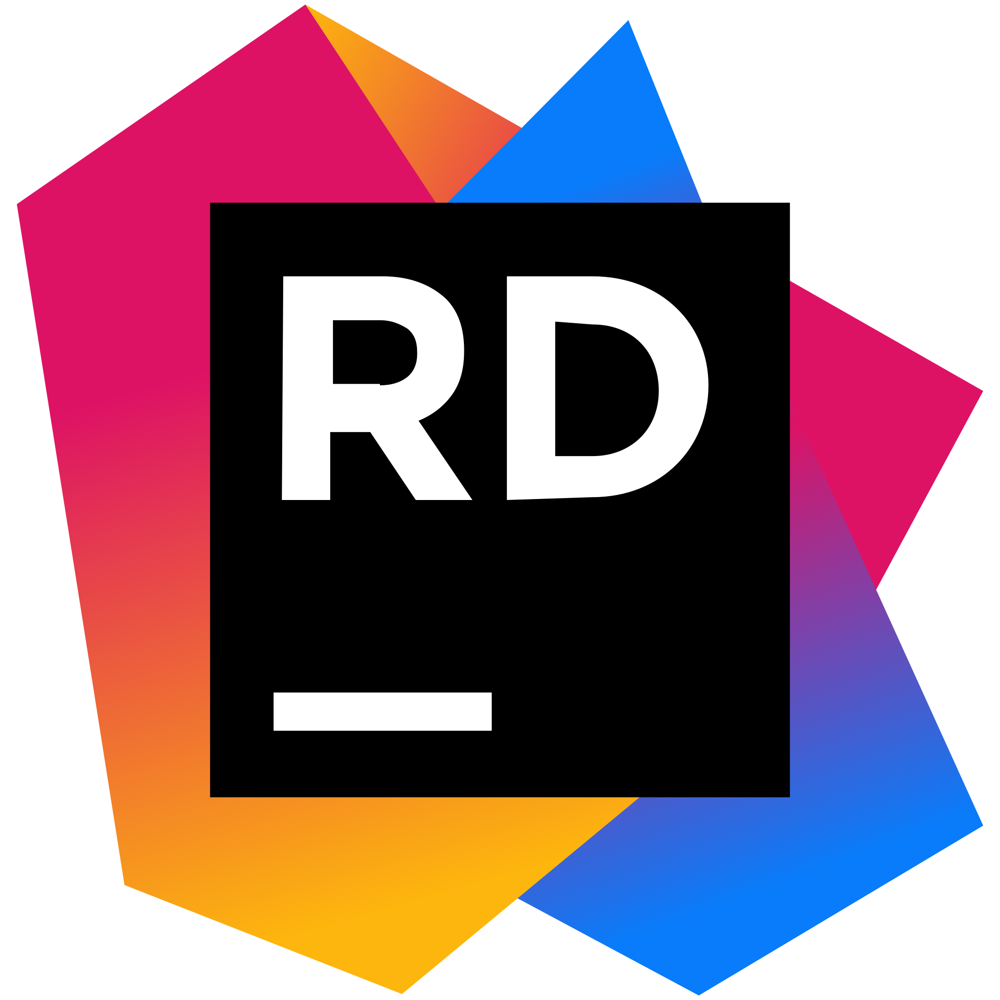
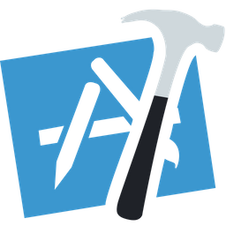

  

---

<!-- 

<code></code>
<code></code>
<code></code>
<code></code>
<code></code>
<code></code>
<code></code>
<code></code>
<code></code>
<code></code>
<code></code>
<code></code>
<code></code>
<code></code>
<code></code>
<code></code>
<code></code>
<code></code>
<code></code>

 -->

<!--
**Tiitmouse/Tiitmouse** is a ✨ _special_ ✨ repository because its `README.md` (this file) appears on your GitHub profile.

