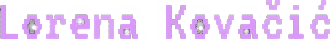
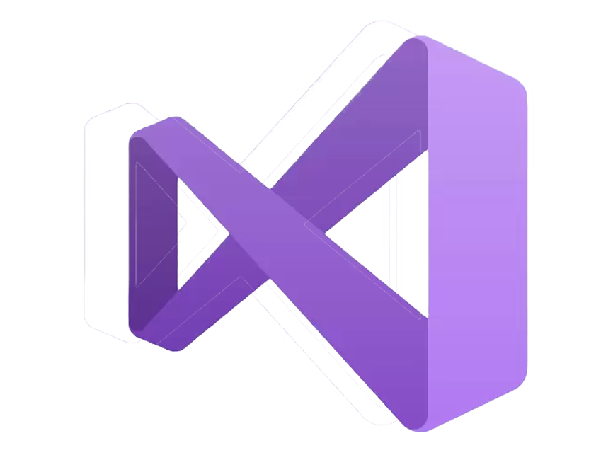

  

---

I am a Software Engineer in my second year at Algebra University. So far, I have been working in C++, C#, and Java. In each, I have completed small projects. At the moment, I am working on 4 medium projects, which repositories are listed below. I am looking for job or student internships that involve game development, with a primary focus on C++ or C#. 

---

<h2 align="Center" style="color:#da99f7") > Stats </h2>
  

      
  

  

      
  

  

      <a href="https://github.com/Tiitmouse/">
        
  

<!-- 

<code></code>
<code></code>
<code></code>
<code></code>
<code></code>
<code></code>
<code></code>
<code></code>
<code></code>
<code></code>
<code></code>
<code></code>
<code></code>
<code></code>
<code></code>
<code></code>
<code></code>
<code></code>
<code></code>

 -->

<!--
**Tiitmouse/Tiitmouse** is a ✨ _special_ ✨ repository because its `README.md` (this file) appears on your GitHub profile.
